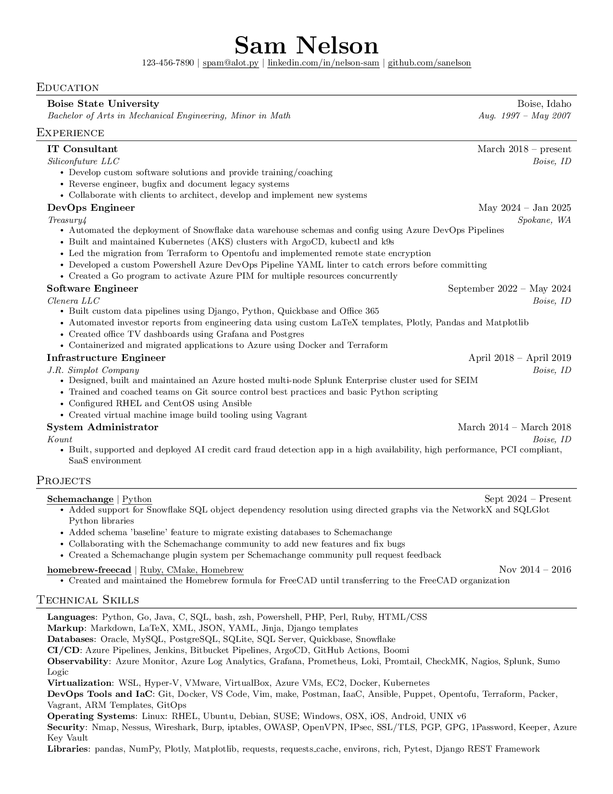

# Summary

LaTeX template for my personal resume



# Prerequisites

## OS Support

Currently the resume build process has only been tested on Ubuntu Linux (under WSL). It *may* work on OSX. The following tools are required:

* Docker
* make
* imagemagick (optional for saving PNG of resume)

## Environment Variables

Confidential contact information is set via the MYPHONE and MYEMAIL variables. You can easily set these in a `.env` file.

```
MYPHONE=123-456-7890
MYEMAIL=spam@alot.py
```

# Usage

To build an updated PDF with the default skill list

```
make
```

This will create a `resume.pdf` file with the skills from `skills.tex`

## Custom Skill Template

In this example we have a custom skill template for a job at Meta `meta_skills.tex`

```
make JOB=meta
```

This will create a `meta_resume.pdf` file with the skills from `meta_skills.tex`

# Acknowledgments

Based off of [jakegut/resume](https://github.com/jakegut/resume]
Which is Based off of [sb2nov/resume](https://github.com/sb2nov/resume/)